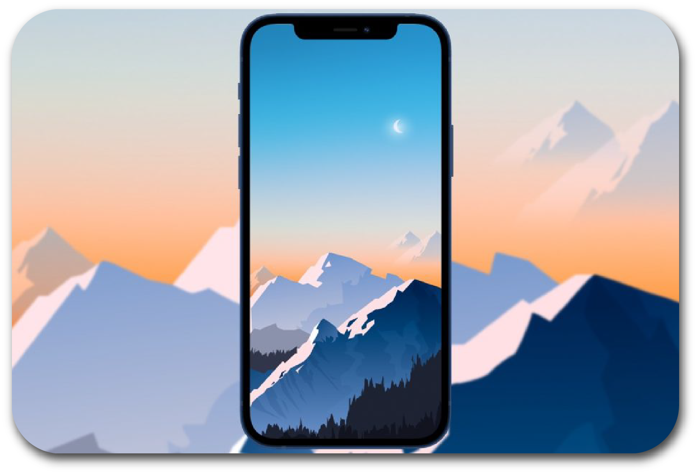

# Wallpaper Market
> "You're not cool unless your wallpapers are..." - Joe Biden

## Project Proposal
Wallpaper Market is a full-stack MERN web application that allows users to search for and download high-resolution background wallpapers for their mobile devices. Users will be able to create an account, add/remove wallpapers from a "favorites" list, and enjoy aesthetically pleasing background art on their personal devices. Users will also have the option of donating any dollar amount to support the poor developers who created this app.

## Project Requirements
- Use React for the front end.

- Use GraphQL with a Node.js and Express.js server.

- Use MongoDB and the Mongoose ODM for the database.

- Use queries and mutations for retrieving, adding, updating, and deleting data.

- Be deployed using Heroku (with data).

- Have a polished UI.

- Be responsive.

- Be interactive (i.e., accept and respond to user input).

- Include authentication (JWT).

- Protect sensitive API key information on the server.

- Have a clean repository that meets quality coding standards (file structure, naming conventions, best practices for class and id naming conventions,    indentation, high-quality comments, etc.).

- Have a high-quality README (with unique name, description, technologies used, screenshot, and link to deployed application).

## Contributions 🤓
Danny Lewis, Caroline Phillips, Kyle Wilson, and Jaden Robison